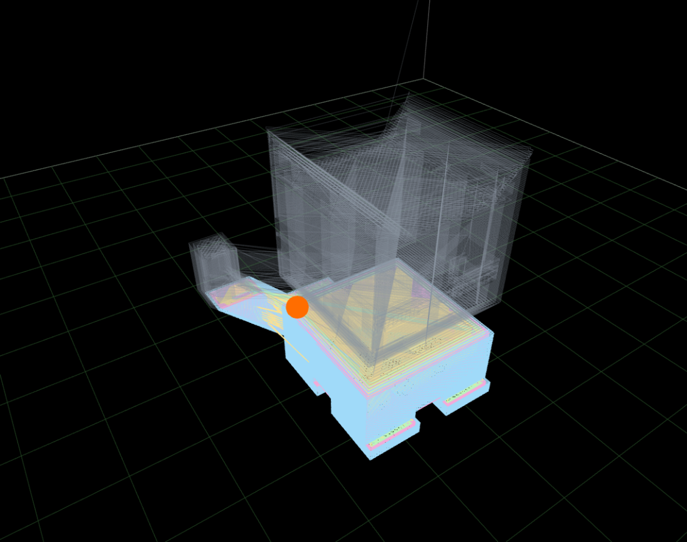

# Chestnut Labs G-code Preview

A worker-based, cross-vendor **G-code toolpath stack** for the browser: parse `.gcode` and
`.gcode.3mf` off the main thread, normalize them into a versioned intermediate representation
(`ToolpathIR`), and render an interactive Three.js preview — with first-class **Vue, React, and
Svelte** integrations that are thin adapters over one shared, framework-neutral engine.

> **Status: pre-release.** The stack is complete and consumable (E0–E6 of the
> [master plan](docs/00_PROJECT_MASTER_PLAN.md) are closed); the first published line, `v0.1.0`,
> ships at the end of the current release epic. Until then, consume via `npm pack` tarballs — see
> *Consuming before the first release* below.


## What you get

- **Off-thread parsing** — a Web Worker session (`GcodeParseSession`) with streaming input,
  progressive preview for large files, resource limits, and an adversarial-input corpus behind it.
- **Cross-vendor dialect handling** — PrusaSlicer, OrcaSlicer/Bambu Studio, Cura, Klipper, Marlin,
  and RepRap-flavor annotations (features, objects, bed geometry, thumbnails, multi-tool), each
  claim capability-tagged as `known | inferred | approximated | unavailable` — the stack refuses to
  fabricate what it cannot know.
- **`.gcode.3mf` container support** — zero-dependency, bounded ZIP extraction with multi-plate
  selection, hardened against adversarial archives.
- **A versioned neutral IR** (`ToolpathIR`) — structure-of-arrays geometry + metadata + source
  index; the seam between parsing and everything else.
- **A Three.js renderer** — layer chunks with decimation disclosure, layer-range clip and
  segment-level scrub, tube or line geometry with automatic quality fallback, per-file build
  plates, WebGL context-loss recovery.
- **Honest live progress** (for printer telemetry) — a normalized `ProgressObservation` contract
  mapped onto the toolpath with tiered confidence: a precise cut + marker when the source position
  is known, an uncertainty band when it is approximated, stale-signal handling, and user scrub
  always winning.
- **Three equal framework adapters** — each ships a ready-to-use `<GcodePreview>` component *and*
  a lower-level surface, with the same capabilities, options, events, and TypeScript contracts,
  enforced by a shared behavioral suite that runs against all three in CI.

| Honest live progress | Layer clipping & scrub |
|---|---|
|  |  |
| Completed cut + translucent remaining-path ghost + byte-exact position marker (uncertainty band when the signal is approximate) | Draw-range layer clipping — no geometry rebuilds; segment-level scrub works the same way |

## Packages

| Package | What it is |
|---|---|
| [`@chestnutlabs/toolpath-core`](packages/toolpath-core) | `ToolpathIR`, capability model, progress mapping |
| [`@chestnutlabs/gcode-parser`](packages/gcode-parser) | Worker parse core + session client (streaming, limits, workers) |
| [`@chestnutlabs/gcode-dialects`](packages/gcode-dialects) | Slicer/firmware dialect annotators |
| [`@chestnutlabs/gcode-containers`](packages/gcode-containers) | `.gcode.3mf` / ZIP container adapters |
| [`@chestnutlabs/gcode-renderer-three`](packages/gcode-renderer-three) | Three.js toolpath renderer (peer: `three`) |
| [`@chestnutlabs/gcode-preview-core`](packages/gcode-preview-core) | Framework-neutral preview controller + portable behavioral suite |
| [`@chestnutlabs/gcode-preview-vue`](packages/gcode-preview-vue) | Vue 3 component + `useGcodePreview()` composable |
| [`@chestnutlabs/gcode-preview-react`](packages/gcode-preview-react) | React component + `useGcodePreview()` hook |
| [`@chestnutlabs/gcode-preview-svelte`](packages/gcode-preview-svelte) | Svelte component + `createGcodePreview()` store/action |

## Quick start

Install the adapter for your framework **plus `three`** (the renderer declares `three` as a
peerDependency, range `^0.178.0` — npm ≥ 7 installs it automatically; pnpm/yarn users add it
explicitly):

```sh
npm install @chestnutlabs/gcode-preview-vue three     # or -react / -svelte
```

Each adapter has two adoption levels — a complete component, and a lower-level API for building
your own controls (composable / hook / store) — documented in its package README.

### Vue

```vue
<script setup>
import { GcodePreview } from '@chestnutlabs/gcode-preview-vue';
import { shallowRef } from 'vue';
const file = shallowRef(null);
</script>

<template>
  <input type="file" accept=".gcode,.3mf" @change="file = $event.target.files?.[0] ?? null" />
  <div style="height: 70vh">
    <GcodePreview :source="file" @ready="(s) => console.log(`${s.segments} segments`)" />
  </div>
</template>
```

Lower level: [`useGcodePreview()`](packages/gcode-preview-vue/README.md) — canvas ref, worker
parse, controls, reactive state summaries.

### React

```tsx
import { GcodePreview } from '@chestnutlabs/gcode-preview-react';

function Viewer({ file }) {
  return (
    <div style={{ height: '70vh' }}>
      <GcodePreview source={file} onReady={(s) => console.log(`${s.segments} segments`)} />
    </div>
  );
}
```

StrictMode-safe. Lower level: [`useGcodePreview()`](packages/gcode-preview-react/README.md)
(`useSyncExternalStore`-backed state, identity-stable handle).

### Svelte

```svelte
<script>
  import GcodePreview from '@chestnutlabs/gcode-preview-svelte/GcodePreview.svelte';
  let file = null;
</script>

<div style="height: 70vh">
  <GcodePreview source={file} on:ready={(e) => console.log(`${e.detail.segments} segments`)} />
</div>
```

Ships as raw `.svelte` (your bundler's Svelte plugin compiles it). Lower level:
[`createGcodePreview()`](packages/gcode-preview-svelte/README.md) — store contract +
`use:` canvas action.

All three components share the same defaulted prop surface — `source`, `parseOptions`,
`buildVolume`, `quality`, `colorMode`, `layerRange`, `scrub`, `showTravel`, `progress`,
`createWorker` — with matching events/callbacks. `<GcodePreview source={file} />` is the whole
thin path; the full viewer is reachable without switching APIs.

## Workers: batteries included, escape hatch provided

- **Default (zero setup):** the adapters create the *batteries* worker — every supported dialect
  adapter plus `.gcode.3mf` support — via the bundler-native `new Worker(new URL(...))` pattern.
  Vite resolves it out of the box (tested in CI).
- **Custom:** pass `createWorker` for the slim build, custom dialect adapters, other bundlers, or
  strict-CSP environments. Both paths are documented in the
  [Vue package README](packages/gcode-preview-vue/README.md) (shared across adapters by design).

## Format, dialect & capability support

- **Formats:** `.gcode` (plain), `.gcode.3mf` (sliced-plate container; multi-plate via
  `parseOptions.plate`).
- **Dialects:** PrusaSlicer, OrcaSlicer/Bambu, Cura, Klipper, Marlin, RepRap-flavor — see the
  evidence-dated [compatibility matrix](docs/compatibility/dialects-and-containers.md).
- **Build volume:** per-file discovered bed geometry with consumer-wins precedence (your
  configured plate is never silently overridden; discovery is emitted instead).
- **Live progress:** the normalized [progress signal contract](docs/reference/progress-signal-contract.md)
  plus [consumer notes](docs/reference/progress-consumer-notes.md) for wiring real printer
  telemetry (Moonraker, Bambu, OctoPrint-class sources).
- **Support & deprecation policy:** [Node/browser/framework matrix and the rolling support
  window](docs/reference/support-policy.md).
- **Headless still render:** [`renderStill`](docs/reference/still-render.md) — a single
  non-interactive image from a Worker `OffscreenCanvas`, Electron hidden window, or headless
  Chromium (server-side thumbnails).

## See it running

- `tools/demo` — the showcase: full control panel over the whole pipeline (corpus picker,
  dialect annotations, quality/color modes, layer clip + scrub, simulated live-progress tiers),
  plus a Vue-component parity page and the visual-regression harness. `npm run dev` inside the
  directory.
- `tools/example-react`, `tools/example-svelte` — complete Vite apps per framework, run the same
  way. All three apps consume the packages exactly as an external consumer would.

## Consuming before the first release

Until `v0.1.0` is on npm, consume via tarballs: build dependency-ordered, `npm pack` each package,
and install with `file:` references — `tools/consumer-vue/run.mjs` is a working, CI-exercised
implementation of exactly that recipe.

## Project status & governance

Docs-first: every architecture-sensitive epic passes a Design Document gate before
implementation. The [master plan](docs/00_PROJECT_MASTER_PLAN.md) controls direction; the
[docs index](docs/README.md) tracks epic status; accepted designs live in
[`docs/design/`](docs/design). Current state: E0–E6 closed and accepted (parser, dialects,
containers, renderer, live progress, multi-framework integration); E7 (release) is in progress —
versioning, publication, container fuzzing, and a headless still-render entry point land there.

Contributions: see [CONTRIBUTING.md](CONTRIBUTING.md) ·
security policy: [SECURITY.md](SECURITY.md).

## Development

```sh
# Node >= 22
npm ci
npm run build            # inherited engine build (rollup)
npm run test             # root suite (IR goldens, manifest validation, adapters)
npm run test:packages    # all workspace package suites
npm run lint && npm run typeCheck && npm run license:check
npm run test:consumer-vue   # tarball consumer fixture
npm run pack:check       # packaged-artifact gate (pack snapshots + publint + attw)
```

## Origin & attribution

This project began as a fork of
[`xyz-tools/gcode-preview`](https://github.com/xyz-tools/gcode-preview) (project identity
`remcoder/gcode-preview`) by Remco Veldkamp and contributors, MIT-licensed. Chestnut Labs has
since rebuilt it into the worker-based multi-package stack described above; the inherited Git
history is preserved, upstream copyright notices are retained in [`LICENSE`](LICENSE), and the
full attribution and provenance record lives in [`NOTICE.md`](NOTICE.md),
[`docs/UPSTREAM_PROVENANCE.md`](docs/UPSTREAM_PROVENANCE.md), and the
[upstream & licensing policy](docs/03_UPSTREAM_FORK_LICENSE_AND_CONTRIBUTION_POLICY.md).
Upstream changes are adopted deliberately through review, never auto-synced.

## License

[MIT](LICENSE) — inherited code © 2017–2025 Remco Veldkamp and the `xyz-tools/gcode-preview`
contributors; Chestnut Labs additions © 2026 Chestnut Labs.
