# G-code Preview

**Show a 3D print or CNC/laser job in the browser — before, during, or after it runs.**
Drop `.gcode`, `.gcode.3mf`, or Prusa `.bgcode` into a web page and get an interactive toolpath
view: orbit it, clip it to a layer, scrub through it, color it by feature or speed, and overlay
live printer progress. Parsing runs in a Web Worker, so a 250 MB file never freezes your UI.

[](https://www.npmjs.com/package/@chestnutlabs/gcode-preview-react)
[](LICENSE)
[](https://chestnutlabs.github.io/gcode-preview/)


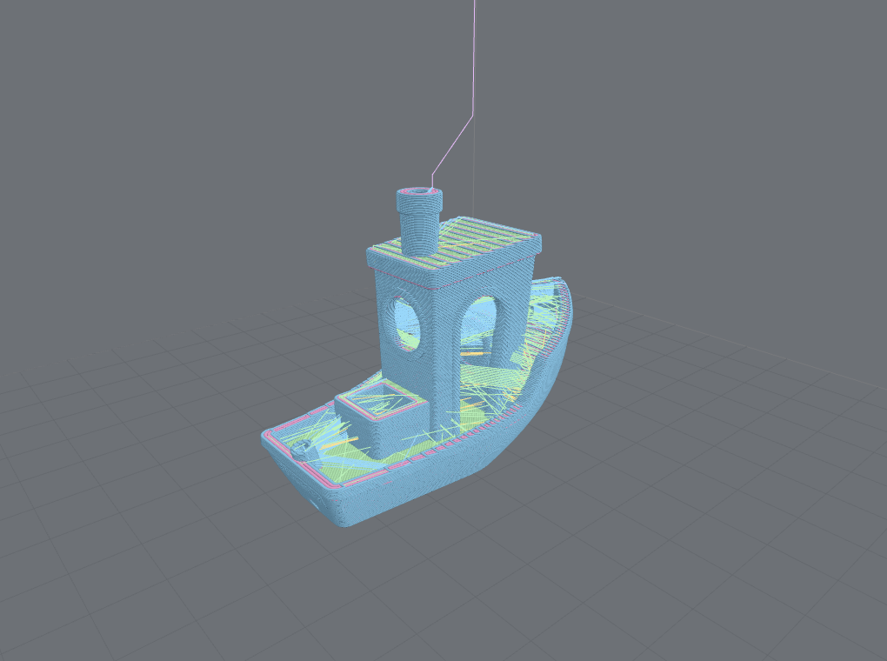

---

## What it is

G-code Preview turns a sliced G-code file into an interactive picture of the actual toolpath. It
reads the file the way the printer will — every move, layer, feature, and tool change — and draws
it with Three.js (or a Canvas 2D fallback for low-GPU devices). It ships as a set of
`@chestnutlabs/*` npm packages with ready-made **Vue, React, Svelte, and Web Component** components,
all built on one shared engine.

One rule runs through the whole thing: **it shows what it can prove and refuses to fake the rest.**
If a slicer didn't record feature types, the viewer says so instead of inventing colors. If live
telemetry only reports a percentage, it draws an uncertainty band, not a false-precise nozzle dot.

```sh
npm install @chestnutlabs/gcode-preview-react three   # or -vue / -svelte / -element
```

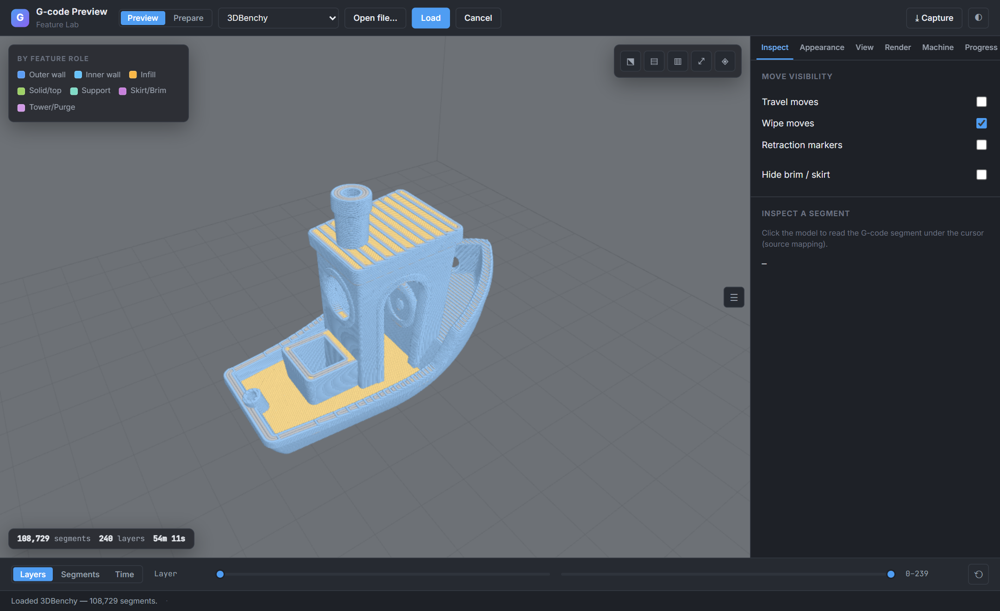

## Why you'd use it

You are building something that needs to *look at* a G-code file, and you don't want to write a
parser and a WebGL renderer to do it:

- **Printer dashboards & farm software** — show each queued or running job, and overlay live
  progress from Moonraker / Klipper / Bambu / OctoPrint-class telemetry onto the real toolpath.
- **Job & file managers** — thumbnail and inspect uploads: layer count, print-time estimate, build
  volume, which slicer produced them.
- **Slicer-adjacent and print-prep tools** — let users clip to a layer, scrub segment-by-segment,
  and check seams, retractions, or travel moves before committing a print.
- **Telemetry / progress UIs** — render an honest "printed so far" overlay that degrades gracefully
  when the signal is coarse or stale.
- **CNC, laser, and plotter tooling** — preview cut/burn/draw paths, color by cut-vs-rapid or tool
  power, and expand canned drilling cycles (support is tier-gated by hardware evidence — see
  [Formats & compatibility](#formats--compatibility)).

Every one of those maps to something the library actually does, below.

## What it does

### Preview & inspection

|  |  |
|---|---|
| 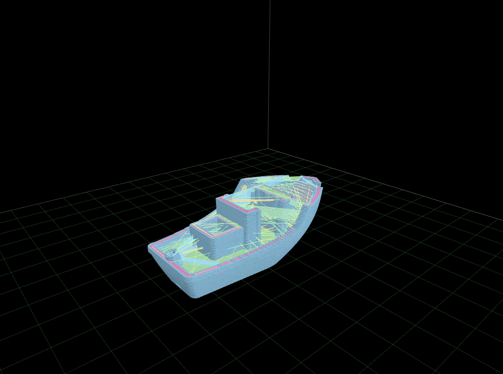 | 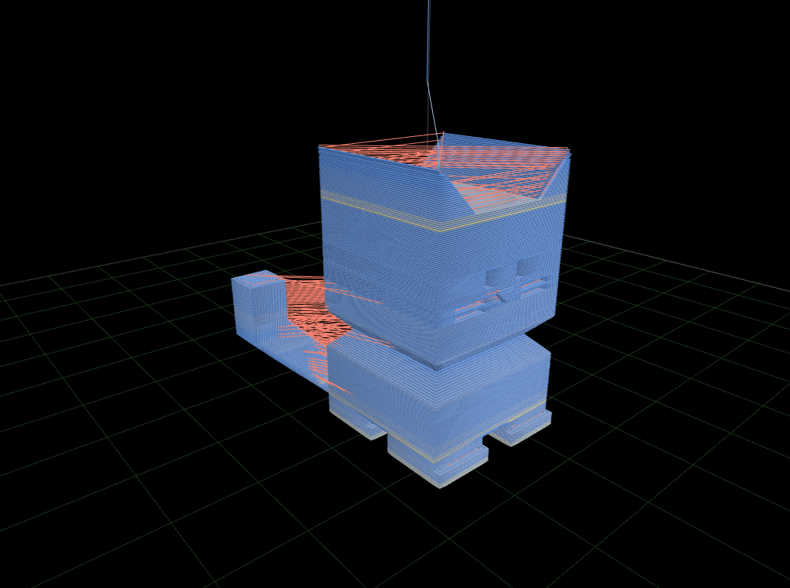 |
| **Layer clipping & scrub** — set a layer range or scrub segment-by-segment. Draw-range updates, no geometry rebuilds. | **Color by speed** — and by feature role, tool, object, per-layer height, or M600 color change. |
| 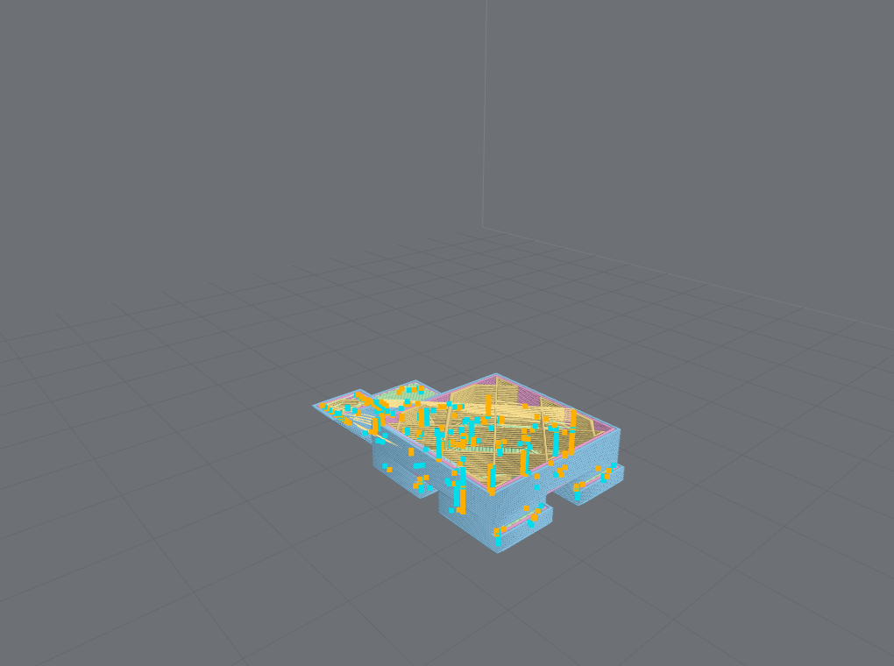 | 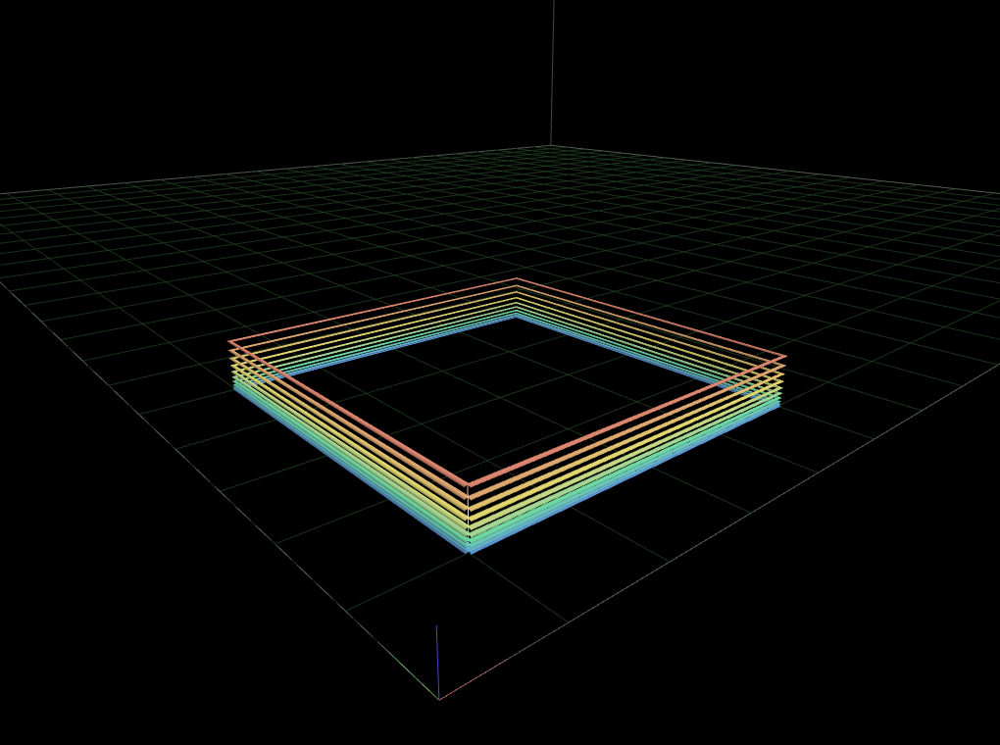 |
| **Retraction & seam inspection** — toggle retraction/de-retraction markers, wipe, and seam moves. | **Color by layer height** — spot variable-layer-height regions at a glance. |

- **Layer range & segment scrub** — isolate any band of layers, or step through the path move by
  move, with a keyboard-operable slider.
- **Time scrub & print-time estimate** — scrub along the *time* axis and read an estimated print
  time, labeled by provenance (the slicer's own estimate, or a kinematic approximation).
- **Feature inspection** — toggle travel, wipe, seam, and retraction/de-retraction markers.
- **Source-line ↔ segment mapping** — go from a byte in the file to the segment it drew, and back.

### Live job progress

| Known position | Approximated position |
|---|---|
|  |  |
| Byte-exact telemetry → a precise cut and an exact position marker. | A layer index or bare percentage → an uncertainty band, not a fake dot. |

Feed it your printer's telemetry and it maps that signal onto the toolpath **at the confidence the
signal deserves**:

- **Known position** (e.g. Moonraker `file_position`) → a precise cut and a byte-exact marker.
- **Approximated** (a layer index or a bare percentage) → an uncertainty band, not a fake dot.
- **Stale** signal → the overlay grays out instead of silently freezing a lie.
- **User scrub always wins** over incoming telemetry.

### Rendering & visualization

- **Three.js renderer** — tube or line geometry with automatic quality fallback, per-file build
  plates, themes, orthographic/perspective cameras, and WebGL context-loss recovery.
- **Canvas 2D fallback** — an optional `renderer="2d"` layer view with no WebGL and no Three.js, for
  low-GPU / low-memory / WebGL-blocked devices. A 2D-only bundle never ships Three.js.
- **Camera presets & saved views** — seven preset angles (top / bottom / front / back / left /
  right / iso), plus a serializable `CameraState` you can persist and restore.
- **Frame what matters** — `frameContent` fits the camera to the printed *object* (excluding skirt,
  prime line, and purge) instead of the whole machine volume; the build-volume cage is a separate
  `showVolumeCage` toggle, independent of the bed/plate.
- **Interaction-aware quality** — `interactionQuality: 'auto'` drops render detail while the camera
  is moving and restores it when the view settles, keeping orbit responsive on big models without
  giving up final-frame fidelity. The hard GPU/vertex-budget fallback still applies underneath.
- **Degradation is disclosed** — over a large-file threshold the renderer decimates and *tells you*
  the exact reduction factor rather than dropping detail silently.

<table>
<tr>
<td width="55%">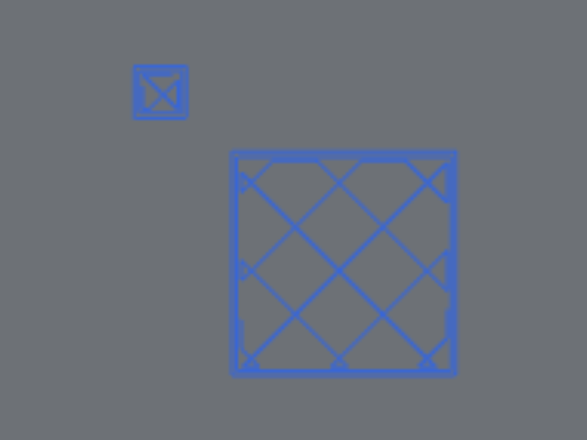</td>
<td><b>Canvas 2D fallback.</b> The same parse feeds a flat layer view with no WebGL and no Three.js — current layer plus adjacent "ghost" layers — for devices where the 3D renderer can't run.</td>
</tr>
</table>

The same 3DBenchy from three preset angles — one click each:

<table>
<tr>
<td>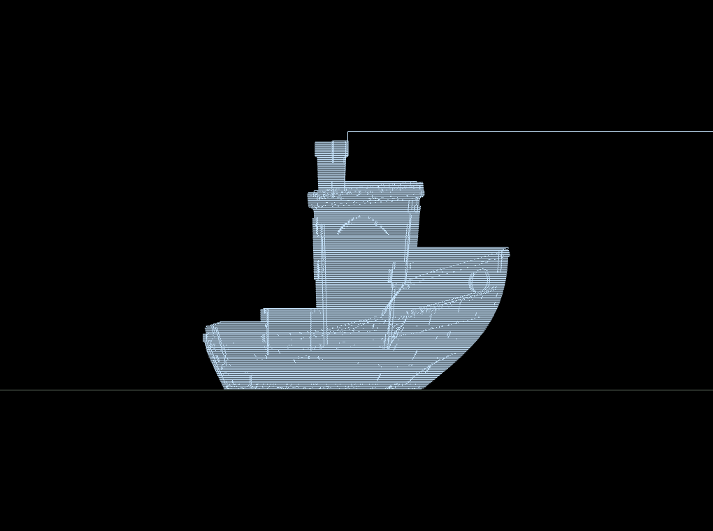</td>
<td>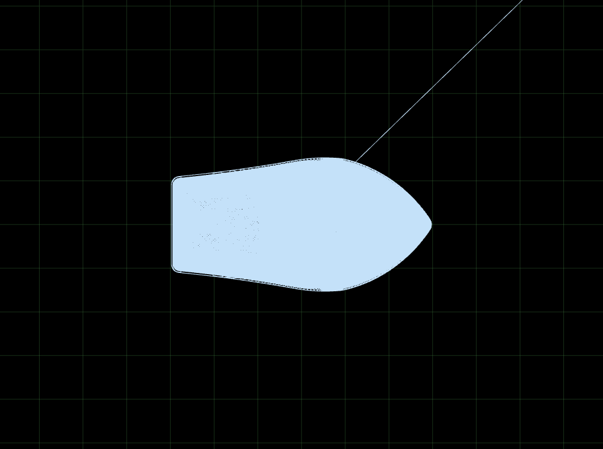</td>
<td>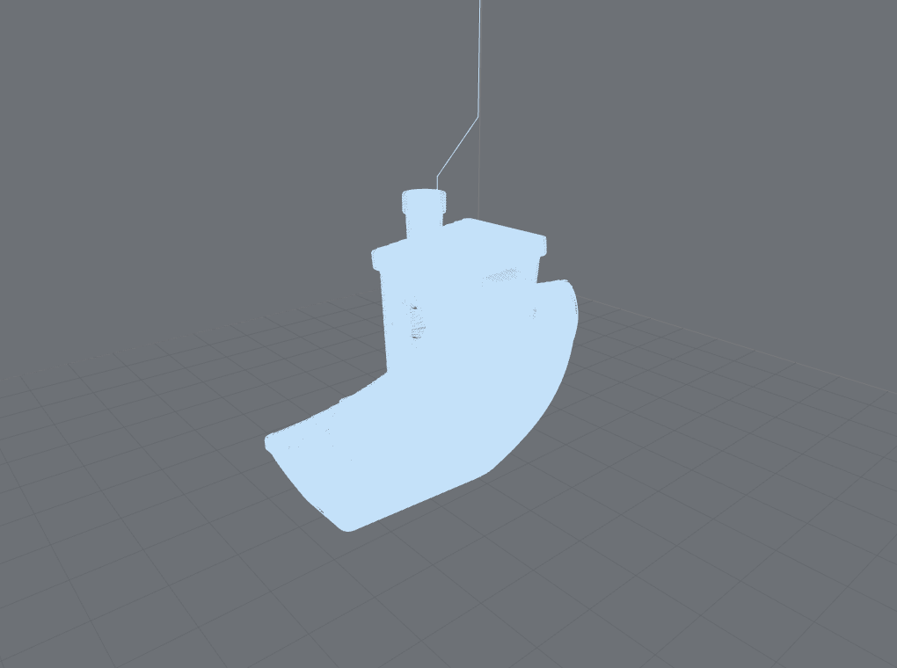</td>
</tr>
<tr>
<td align="center">Front (ortho)</td><td align="center">Top (ortho)</td><td align="center">Iso</td>
</tr>
</table>

### Beyond FDM — CNC, laser, plotter

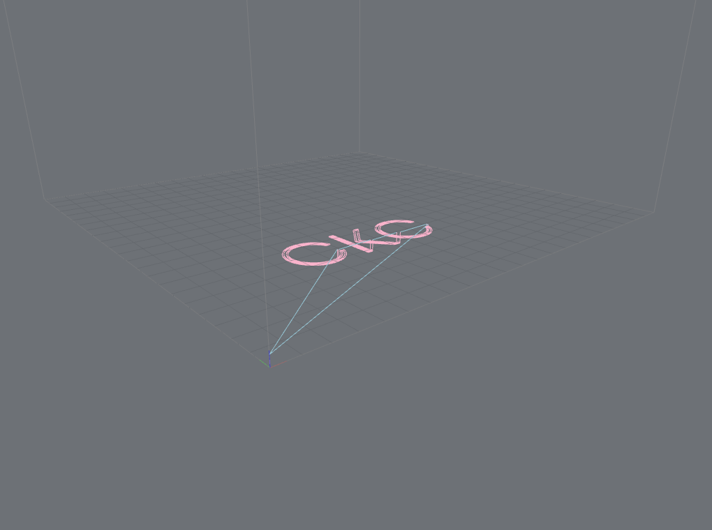

Non-extrusion toolpaths classify tool-engaged moves as `Cut`, expose a modal tool-power channel
(laser power / spindle RPM), and expand canned drilling cycles (`G81` / `G82` / `G83`). Coloring by
**cut-vs-rapid** or **tool power** makes the difference visible. This support is **honesty-tiered**:
a controller's semantic claims are reported `inferred` until confirmed on real hardware, then `known`
— today **GRBL/LightBurn laser is hardware-validated**; GRBL-mill and LinuxCNC are experimental.
Geometry always parses regardless of tier.

### Framework integration

Four adapters over one engine, with matching options, events, and TypeScript types — enforced by a
shared behavioral test suite that runs against all four in CI:

| Adapter | Package | Component + lower-level API |
|---|---|---|
| **Vue 3** | [`@chestnutlabs/gcode-preview-vue`](packages/gcode-preview-vue) | `<GcodePreview>` + `useGcodePreview()` composable |
| **React** | [`@chestnutlabs/gcode-preview-react`](packages/gcode-preview-react) | `<GcodePreview>` + `useGcodePreview()` hook (StrictMode-safe) |
| **Svelte** | [`@chestnutlabs/gcode-preview-svelte`](packages/gcode-preview-svelte) | `<GcodePreview>` + `createGcodePreview()` store/action |
| **Web Component** | [`@chestnutlabs/gcode-preview-element`](packages/gcode-preview-element) | `<gcode-preview>` custom element, no framework peer |

### Browser & performance architecture

- **Off-thread parsing** — a `GcodeParseSession` runs the parser in a Web Worker with streaming
  input, progressive previews for large files, resource limits, and cancellation.
- **Batteries-included worker** — the adapters wire up a worker with every dialect and `.gcode.3mf`
  support via the bundler-native `new Worker(new URL(...))` pattern (Vite works out of the box); a
  `createWorker` hook is the escape hatch for slim builds, custom dialects, or strict-CSP hosts.
- **Headless still render** — [`renderStill`](docs/reference/still-render.md) produces a single
  non-interactive image from an `OffscreenCanvas`, an Electron hidden window, or headless Chromium,
  for server-side thumbnails.

## Two views, two jobs: toolpath vs. model

Everything above renders the **toolpath** — the moves the machine makes. That answers *how the job
runs*: where the seams are, which layer a retraction happens on, how travel threads between islands.
But sometimes you don't want the toolpath at all — you want a clean picture of *what the object is*,
the way a slicer's file browser shows a part. Those are two different jobs, so they're two different
renderers:

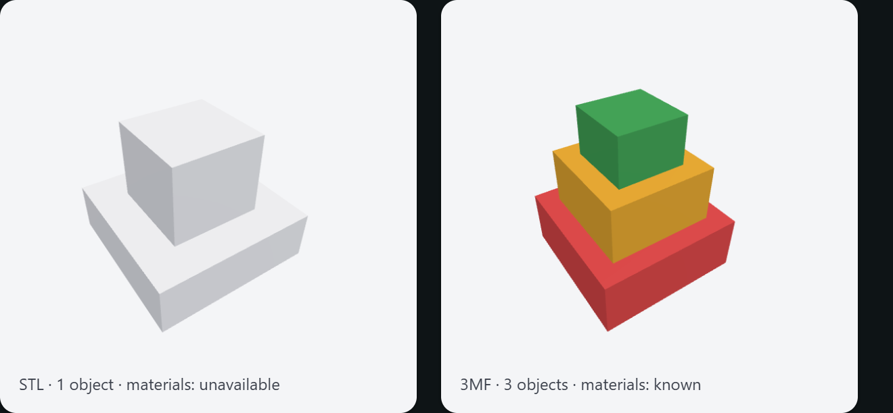

| | Toolpath renderer | Model renderer |
|---|---|---|
| **Package** | `@chestnutlabs/gcode-renderer-three` (+ `-2d`) | `@chestnutlabs/gcode-model-renderer` |
| **Input** | Parsed G-code (`ToolpathIR`) | The **source model** — `.stl` or `.3mf` mesh |
| **Answers** | *How does this print/cut run?* | *What object is this?* |
| **Looks like** | Extrusion tubes / lines, layers, travel, color modes | A solid, studio-lit part at a fixed 3/4 angle |
| **Use it for** | Inspection, clip/scrub, live progress, seams | Thumbnails, cards, library grids, "what's in this file" |

The model renderer is a presentation surface, not a second toolpath viewer. It takes an STL or a 3MF
mesh, frames it, lights it with a neutral studio rig, and draws it — nothing about layers, moves, or
print order. **3MF** brings its own multi-object structure and per-object / per-triangle material
colors; a bare **STL** is a single object with no declared material.

It keeps the same honesty rule as the rest of the library. When the source actually declares colors
(3MF `basematerials`), the render uses them. When it doesn't — a plain STL, or a proprietary paint
format the standard doesn't cover — it draws a neutral default and reports `materials: 'unavailable'`
rather than inventing a color. The headless
[`renderModelStill`](packages/gcode-model-renderer/README.md) mirrors `renderStill`: hand it bytes,
get back a canvas plus a stable `cacheKey` and the `materials` confidence for that render.

```ts
import { renderModelStill } from '@chestnutlabs/gcode-model-renderer';

const { canvas, materials, cacheKey } = await renderModelStill(
  { kind: 'stl', bytes },                       // or { kind: '3mf', bytes }
  { canvas: new OffscreenCanvas(512, 512), background: 'transparent' }
);
// materials: 'known' when the source carried colors, 'unavailable' when it didn't.
```

Need it live rather than as a thumbnail — a "View in 3D" for the part? `createModelViewer` is the
interactive analogue of the still: it orbits, zooms, and pans the same STL / 3MF (including production
multicolor) with camera presets and the same serializable camera state, over the shared camera and
orbit controls. See the
[model-renderer README](packages/gcode-model-renderer/README.md#interactive-viewer).

## Quick start

Install an adapter **plus `three`** (the renderer declares `three` as a peer dependency, range
`^0.178.0`; npm ≥ 7 installs it automatically, pnpm/yarn users add it explicitly):

```sh
npm install @chestnutlabs/gcode-preview-react three
```

```tsx
import { GcodePreview } from '@chestnutlabs/gcode-preview-react';

function Viewer({ file }) {                 // file: a File from an <input>, or a Uint8Array
  return (
    <div style={{ height: '70vh' }}>
      <GcodePreview source={file} onReady={(s) => console.log(`${s.segments} segments`)} />
    </div>
  );
}
```

`<GcodePreview source={file} />` is the whole thin path; the full viewer — layer clip, scrub, color
modes, cameras, live progress — is reachable through props and the lower-level hook without
switching APIs.

<details>
<summary><b>Vue</b></summary>

```vue
<script setup>
import { GcodePreview } from '@chestnutlabs/gcode-preview-vue';
import { shallowRef } from 'vue';
const file = shallowRef(null);
</script>

<template>
  <input type="file" accept=".gcode,.3mf,.bgcode" @change="file = $event.target.files?.[0] ?? null" />
  <div style="height: 70vh">
    <GcodePreview :source="file" @ready="(s) => console.log(`${s.segments} segments`)" />
  </div>
</template>
```
Lower level: [`useGcodePreview()`](packages/gcode-preview-vue/README.md).
</details>

<details>
<summary><b>Svelte</b></summary>

```svelte
<script>
  import GcodePreview from '@chestnutlabs/gcode-preview-svelte/GcodePreview.svelte';
  let file = null;
</script>

<div style="height: 70vh">
  <GcodePreview source={file} on:ready={(e) => console.log(`${e.detail.segments} segments`)} />
</div>
```
Ships as raw `.svelte` (your bundler's Svelte plugin compiles it). Lower level:
[`createGcodePreview()`](packages/gcode-preview-svelte/README.md).
</details>

<details>
<summary><b>Web Component (no framework)</b></summary>

```html
<script type="module">
  import '@chestnutlabs/gcode-preview-element/define';   // registers <gcode-preview>
</script>

<gcode-preview quality="tubes" style="display:block;height:70vh"></gcode-preview>
<script type="module">
  const el = document.querySelector('gcode-preview');
  el.source = await (await fetch('/model.gcode')).arrayBuffer();  // Uint8Array | ArrayBuffer | File
</script>
```
See [`@chestnutlabs/gcode-preview-element`](packages/gcode-preview-element/README.md) for the full
attribute/property table.
</details>

All four adapters share the same option surface — `source`, `parseOptions`, `buildVolume`,
`quality`, `colorMode`, `layerRange`, `scrub`, `showTravel`, `progress`, `cameraMode`, `view`,
`cameraState`, `showVolumeCage`, `frameContent`, `interactionQuality`, `theme`, `createWorker` —
with matching events (`ready` — now carrying parsed slice `metadata` when the dialect supplied it —
`parse-progress`, `build-complete`, `quality-fallback`, `error`, and more). The
[cross-adapter guide](docs/manual/adapters.md) and each package README are the canonical reference.

## Formats & compatibility

**Input formats**

| Format | Support |
|---|---|
| `.gcode` (plain) | Full geometry always. |
| `.gcode.3mf` (Orca/Bambu container) | Bounded, zero-dependency ZIP extraction; multi-plate via `parseOptions.plate`. |
| `.bgcode` (Prusa binary) | Decoded (heatshrink / DEFLATE / MeatPack) to plain G-code through the same pipeline, byte-for-byte equivalent. |

**Slicer & firmware dialects** annotate the toolpath with feature roles, objects, bed geometry, and
more: **PrusaSlicer, OrcaSlicer / Bambu Studio, Cura, Klipper, Marlin, and RepRap-flavor**. Every
annotation carries a confidence tier (below). See the evidence-dated
[compatibility matrix](docs/compatibility/dialects-and-containers.md) and
[G-code motion coverage](docs/compatibility/gcode-motion-coverage.md) for the exact per-dialect state.

**The honesty model.** Every derived fact is tagged with how sure the parser is:

| Tier | Meaning |
|---|---|
| `known` | Observed directly from the file. |
| `inferred` | Not stated, resolved from a defensible default — and disclosed as a default. |
| `approximated` | Derived with known error (e.g. a position between two sparse signals). |
| `unavailable` | Cannot be determined from this input. |

This is why capability-gated features (a color mode, a live-progress marker, a CNC classification)
either work from real data or explain why they can't — they never render something the file didn't
contain. Details: [ToolpathIR & the capability model](docs/manual/concept-ir-capabilities.md).

## Documentation

- **[Manual & getting started](https://chestnutlabs.github.io/gcode-preview/)** and the
  **[API reference](https://chestnutlabs.github.io/gcode-preview/api/)** (generated from source).
- Concepts: [workers & performance](docs/manual/concept-workers.md) ·
  [IR & capabilities](docs/manual/concept-ir-capabilities.md) ·
  [dialects & containers](docs/manual/concept-dialects-containers.md) ·
  [progress & motion](docs/manual/concept-progress-motion.md)
- Guides: [cross-adapter tour](docs/manual/adapters.md) · [recipes](docs/manual/recipes.md)
- References: [progress-signal contract](docs/reference/progress-signal-contract.md) ·
  [live-progress consumer notes](docs/reference/progress-consumer-notes.md) ·
  [headless still render](docs/reference/still-render.md) ·
  [support & deprecation policy](docs/reference/support-policy.md) ·
  [multiple previews on one page](docs/reference/multi-gcode-previews.md)

## Try it locally

`tools/demo` is the showcase: the whole pipeline behind one control panel — corpus picker, dialect
annotations, quality/color modes, layer clip + time/segment scrub, camera presets and save/restore,
simulated live-progress tiers, themes, and STL export.

```sh
cd tools/demo
npm install
npm run dev        # http://localhost:5199
```

`tools/example-react` and `tools/example-svelte` are complete standalone Vite apps. All three consume
the packages exactly as an external consumer would.

## How it's built

The stack is a pipeline of small packages, each doing one job:

```
 G-code  ─▶  parser (Web Worker)  ─▶  ToolpathIR  ─▶  toolpath renderer  ─▶  canvas
             dialects · containers    (neutral,        three / 2d
             · bgcode decode           versioned)      + colors

 STL / 3MF mesh  ─────────────────▶  ModelScene  ─▶  model renderer  ─▶  canvas
                                     (presentation)   (shared render stage)
```

The two rows share the render "stage" (framing + GL builder) but are otherwise independent: the top
row inspects the *toolpath*, the bottom row presents the *source model* (see
[Two views, two jobs](#two-views-two-jobs-toolpath-vs-model)).

- **[`@chestnutlabs/toolpath-core`](packages/toolpath-core)** — `ToolpathIR` (structure-of-arrays
  geometry + metadata + source index), the capability model, progress mapping, and time estimation.
  The neutral seam every other package reads or writes.
- **[`@chestnutlabs/gcode-parser`](packages/gcode-parser)** — the worker parse core and
  `GcodeParseSession` client: streaming input, progressive previews, resource limits, cancellation.
- **[`@chestnutlabs/gcode-dialects`](packages/gcode-dialects)** — slicer/firmware annotators. They
  add metadata and optional channels; they can never alter geometry.
- **[`@chestnutlabs/gcode-containers`](packages/gcode-containers)** — bounded, in-memory
  `.gcode.3mf` / ZIP extraction, hardened against adversarial archives.
- **[`@chestnutlabs/gcode-bgcode`](packages/gcode-bgcode)** — Prusa `.bgcode` decode (license-clean
  MeatPack + heatshrink), registered as a container adapter so `.bgcode` "just works".
- **[`@chestnutlabs/gcode-colors`](packages/gcode-colors)** — the renderer-agnostic `ColorMode`
  model (feature, speed, tool, object, layer-height, color-change, tool-power, cut-vs-rapid), shared
  by both toolpath renderers.
- **[`@chestnutlabs/gcode-renderer-three`](packages/gcode-renderer-three)** — the Three.js toolpath
  renderer (peer: `three`): layer chunks, decimation disclosure, draw-range clip/scrub, cameras,
  themes, live-progress overlay. Also exports the shared render "stage" (framing pose + GL builder).
- **[`@chestnutlabs/gcode-renderer-2d`](packages/gcode-renderer-2d)** — the Canvas 2D `LayerView2D`
  (no WebGL, no `three`): current + adjacent "ghost" layers.
- **[`@chestnutlabs/gcode-model-renderer`](packages/gcode-model-renderer)** — a **separate**
  presentation renderer (peer: `three`) for the *source model* — STL and 3MF multi-object/material —
  with headless `renderModelStill`. It answers "what object is this?", not "how does the toolpath
  run?"; see [Two views, two jobs](#two-views-two-jobs-toolpath-vs-model).
- **[`@chestnutlabs/gcode-preview-core`](packages/gcode-preview-core)** — the framework-neutral
  controller, immutable state model, `renderStill`, and the portable behavioral suite.
- **[`-vue`](packages/gcode-preview-vue) · [`-react`](packages/gcode-preview-react) ·
  [`-svelte`](packages/gcode-preview-svelte) · [`-element`](packages/gcode-preview-element)** — the
  four framework adapters.

Design rationale, boundaries, and the accepted architecture live in
[`docs/design/`](docs/design); the [docs index](docs/README.md) maps the whole set. Fourteen
packages publish to npm in lockstep (currently **v0.10.0**) with npm provenance.

## Development

```sh
# Node >= 22
npm ci
npm run build            # legacy engine build (rollup)
npm run test             # root suite (IR goldens, manifest validation, adapters)
npm run test:packages    # all workspace package suites
npm run lint && npm run typeCheck && npm run license:check
npm run docs:links       # verify documentation links
```

To rebuild the workspace packages the demo consumes, build them in dependency order
(`toolpath-core` → colors/containers/dialects → bgcode → parser → renderers → core → adapters);
see [`tools/screenshots/README.md`](tools/screenshots/README.md) for the documentation-media
capture harness.

Contributing: [CONTRIBUTING.md](CONTRIBUTING.md) · security policy: [SECURITY.md](SECURITY.md) ·
documentation standard: [docs/USER_FACING_DOCS_STYLE.md](docs/USER_FACING_DOCS_STYLE.md).

## Origin & attribution

This project began as a fork of
[`xyz-tools/gcode-preview`](https://github.com/xyz-tools/gcode-preview) (project identity
`remcoder/gcode-preview`) by Remco Veldkamp and contributors, MIT-licensed. Chestnut Labs has
rebuilt it into the worker-based, multi-package browser toolpath toolkit described above. The
inherited Git history is preserved, upstream copyright notices are retained in [`LICENSE`](LICENSE),
and the full provenance record lives in [`NOTICE.md`](NOTICE.md),
[`docs/UPSTREAM_PROVENANCE.md`](docs/UPSTREAM_PROVENANCE.md), and the
[upstream & licensing policy](docs/03_UPSTREAM_FORK_LICENSE_AND_CONTRIBUTION_POLICY.md). Upstream
changes are adopted deliberately through review, never auto-synced.

## License

[MIT](LICENSE) — inherited code © 2017–2025 Remco Veldkamp and the `xyz-tools/gcode-preview`
contributors; Chestnut Labs additions © 2026 Chestnut Labs.
