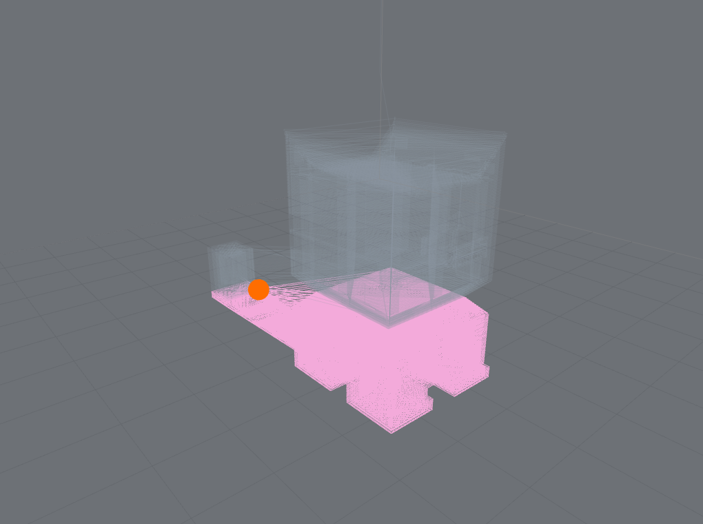
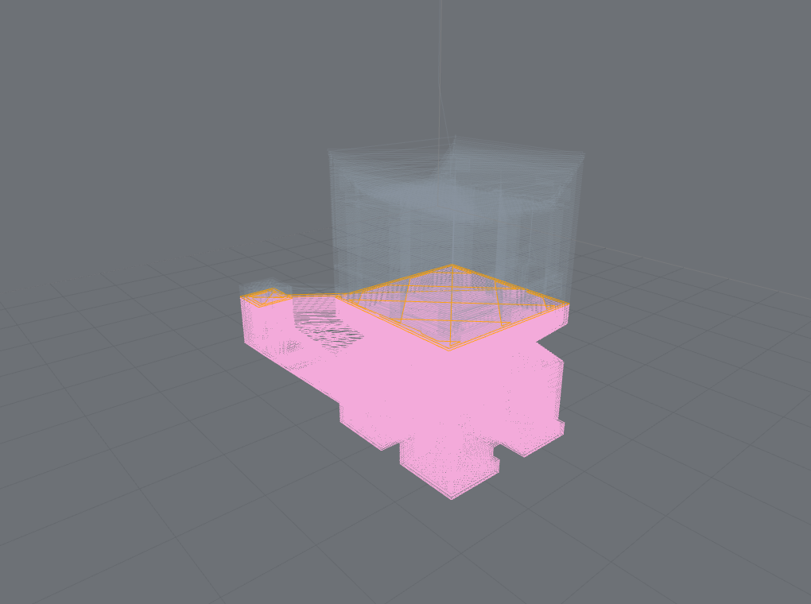

# Live progress & motion model

Two places where the stack's honesty rule (see [the capability model](concept-ir-capabilities.md))
does real work: mapping a running printer onto the toolpath, and interpreting motion commands whose
meaning is firmware-specific.

## Live progress

Feed a normalized **`ProgressObservation`** (adapted from Moonraker, Bambu, OctoPrint-class sources)
and the stack maps it onto the toolpath with **tiered confidence**:

- source position **known** → a precise cut plus a byte-exact position marker;
- position **approximated** → an uncertainty band rather than a false-precise dot;
- **stale** signal → handled explicitly, not silently frozen;
- **user scrub always wins** over incoming telemetry.

| Known position | Approximated position |
|---|---|
|  |  |
| Byte-exact telemetry → a precise cut and an exact marker. | A layer index or bare percentage → an uncertainty band, not a fake dot. |

The normalized contract and consumer guidance are in the
[progress signal contract](https://github.com/ChestnutLabs/gcode-preview/blob/dev/docs/reference/progress-signal-contract.md)
and [consumer notes](https://github.com/ChestnutLabs/gcode-preview/blob/dev/docs/reference/progress-consumer-notes.md).
Pass it via the `progress` prop.

## Motion model

The interpreter models position-affecting commands and — again — discloses its confidence rather
than guessing silently:

- **Extruder mode** (`M82`/`M83`) — extrude vs. travel is classified from the true per-move E
  **delta**, not the raw E word, so an absolute-E (`M82`) file no longer misreads travel as
  extrusion. Disclosed via the `extrusionMode` capability.
- **Positioning mode** (`G90`/`G91`) — absolute vs. relative XYZ. Disclosed via `positioningMode`.
- **`G92` E-datum** — an extruder-datum reset so the next move's delta is correct.

### Firmware conditioning

Absolute is the power-on default (the Marlin/RepRapFirmware convention). Whether `G90`/`G91` *also*
switch the **extruder** mode is firmware-specific, so it is gated on
`parseOptions.extruderFollowsPositioning`: Marlin/Klipper set it `true` (E follows `G90`/`G91`
unless `M82`/`M83` override); RepRapFirmware leaves it `false` (XYZ and E independent). Explicit
`M82`/`M83` always win. When neither the mode nor a firmware hint is known, the capability is
disclosed as `inferred`, never `known`.

Coverage — including what's still in progress (arc planes `G17`–`G19`, work-coordinate systems) — is
in the [motion coverage matrix](https://github.com/ChestnutLabs/gcode-preview/blob/dev/docs/compatibility/gcode-motion-coverage.md).
