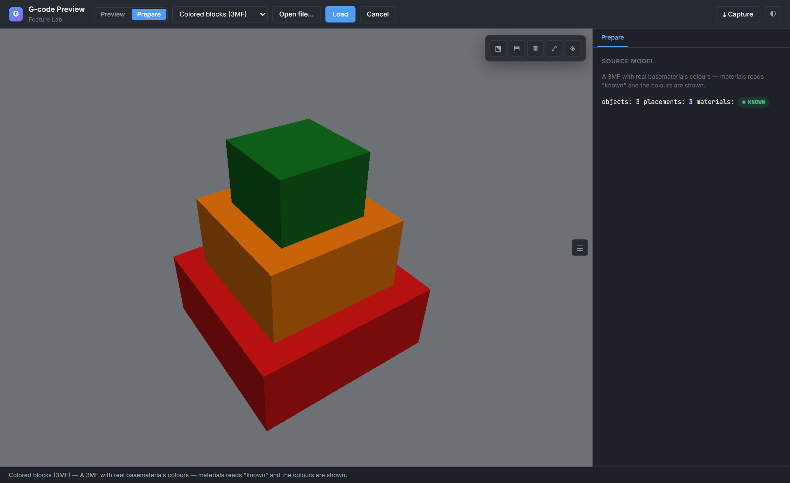
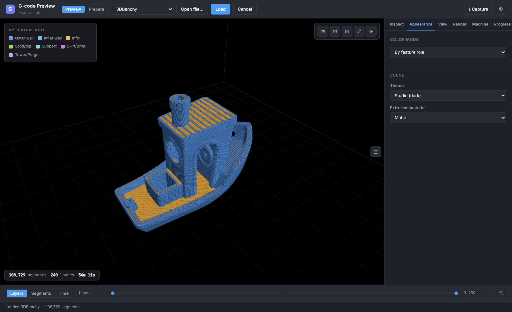
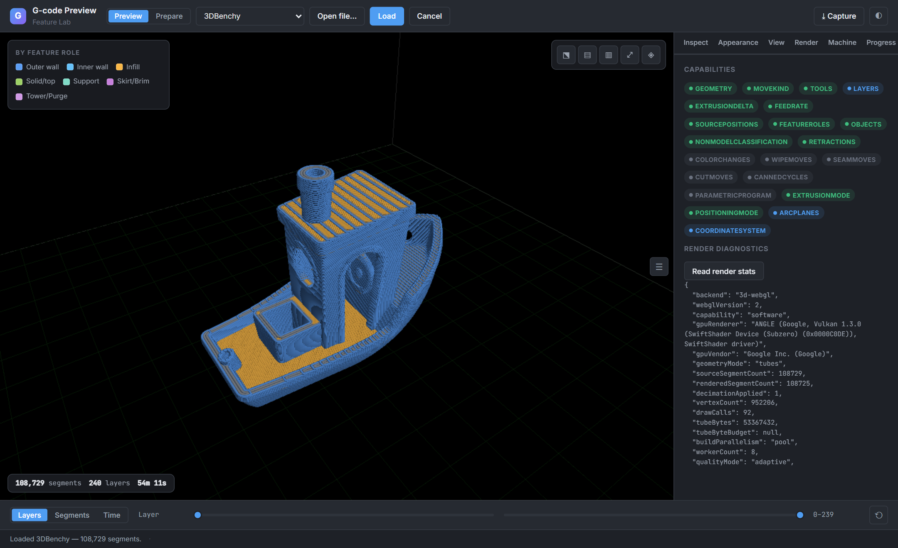
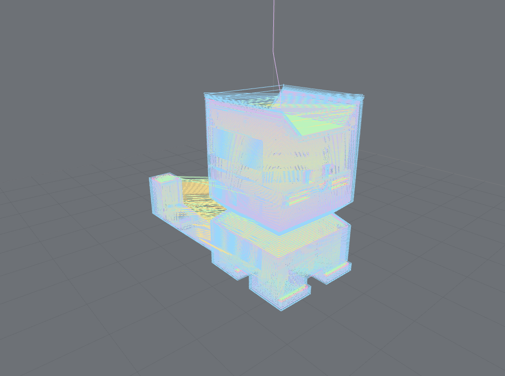
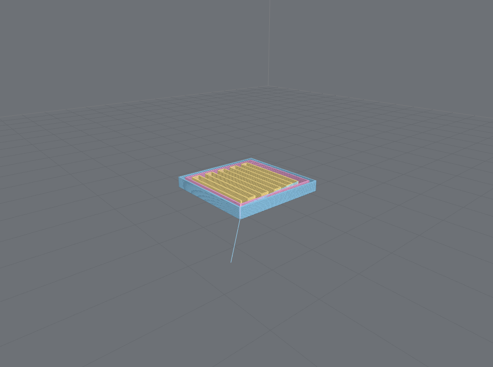
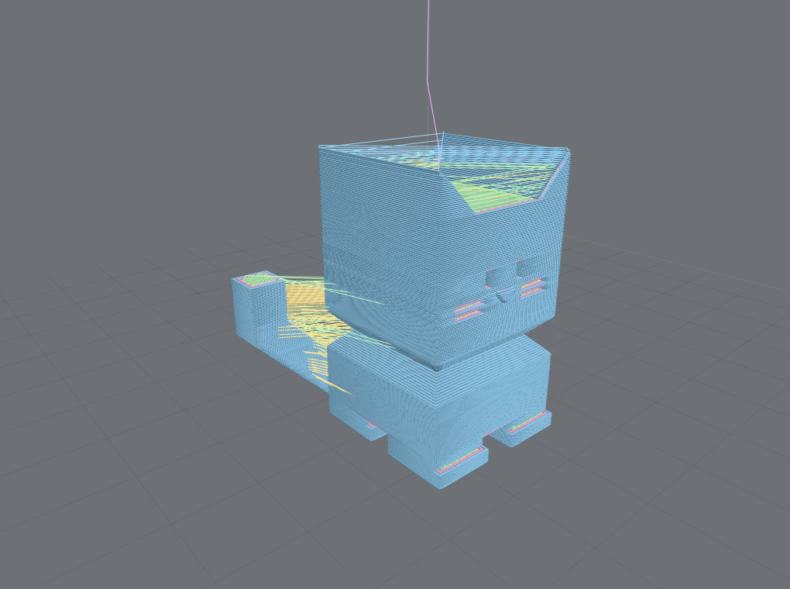
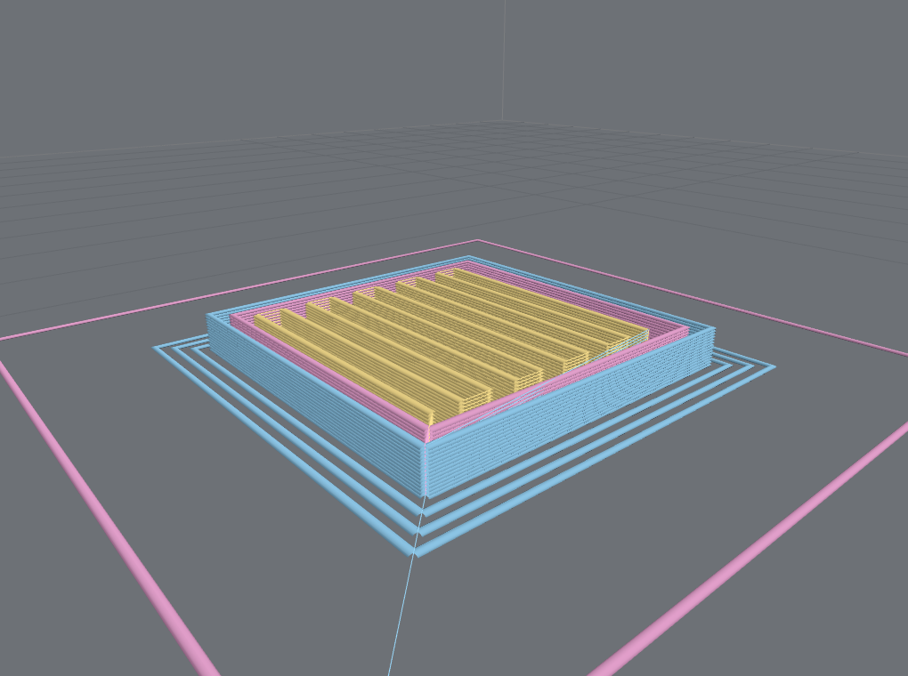
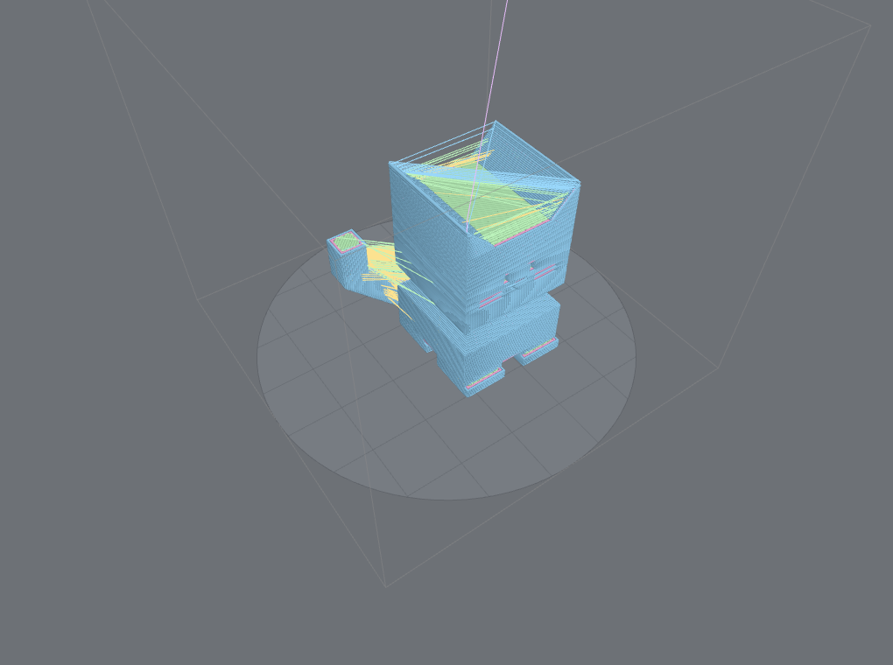
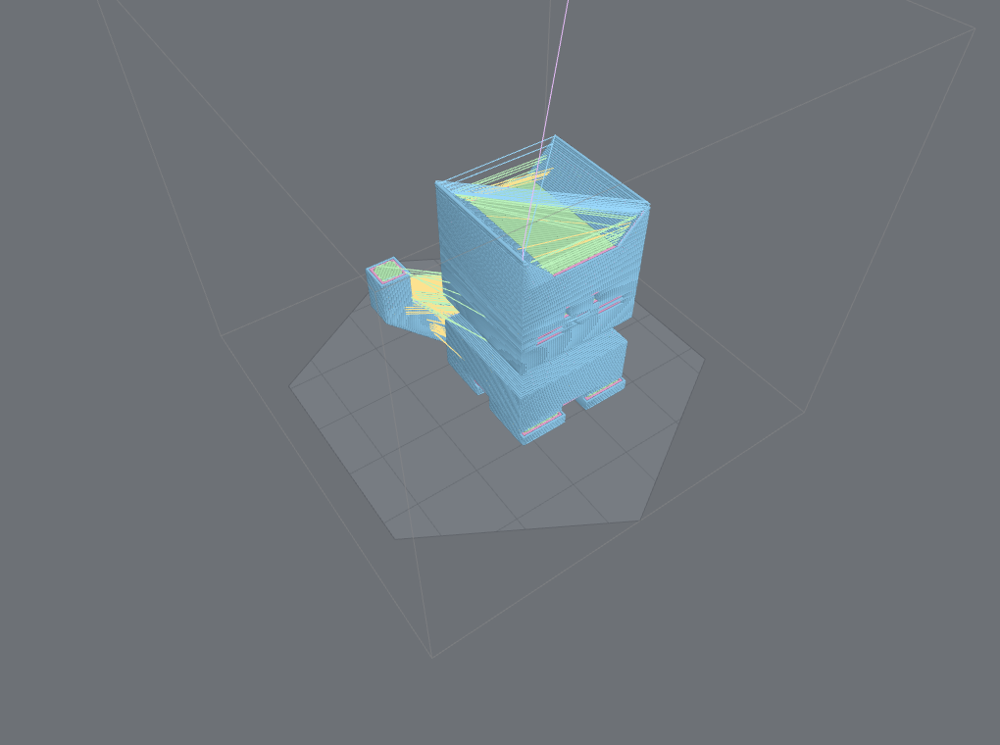
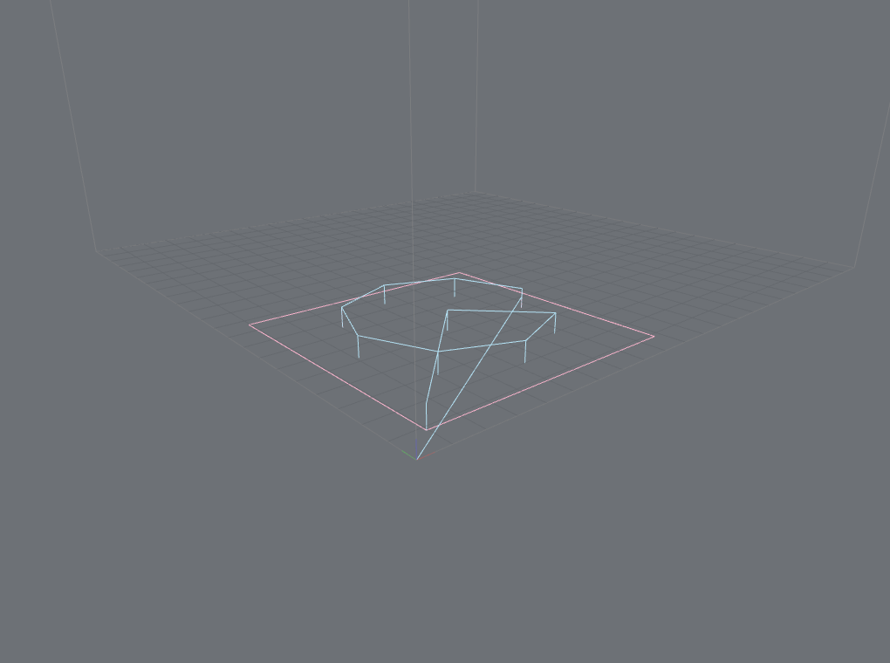

# Feature gallery

What G-code Preview can actually do, shown rather than described. Every image is a **real render of a
real file** from the tracked demo corpus, captured by [`tools/screenshots/`](https://github.com/ChestnutLabs/gcode-preview/tree/dev/tools/screenshots)
on a neutral slicer/CAD viewport — nothing mocked. This page is the visual companion to the
[capability model](concept-ir-capabilities.md) and the per-feature
[coverage matrix](https://github.com/ChestnutLabs/gcode-preview/blob/dev/docs/VISUAL_FEATURE_COVERAGE.md).

> New here? Start with the [getting-started guide](index.md), then come back to browse the breadth.

> The capability shots below are **real renders** on a neutral mid-grey documentation viewport. The
> application shots in this first section show the **live Feature Lab** in its studio-dark chrome —
> the actual interactive product.

## Try it live — Prepare & Preview

**▶ [Open the live demos](https://chestnutlabs.github.io/gcode-preview/demos/)** — the interactive
[Feature Lab](https://chestnutlabs.github.io/gcode-preview/demos/feature-lab/index.html) and the
[React](https://chestnutlabs.github.io/gcode-preview/demos/react/showcase.html) /
[Vue](https://chestnutlabs.github.io/gcode-preview/demos/vue/showcase.html) /
[Svelte](https://chestnutlabs.github.io/gcode-preview/demos/svelte/showcase.html) /
[Web Component](https://chestnutlabs.github.io/gcode-preview/demos/webcomponent/showcase.html)
examples, running in your browser on the published `@chestnutlabs/*` packages.

The SDK covers **both halves** of looking at a print job — the sliced toolpath (Preview) and the
source model (Prepare), each with real controls:

| Preview — the sliced toolpath | Prepare — the source model |
|---|---|
|  |  |
| Layers, features, speed, travel, retractions, source-line picking — the toolpath controls. | STL / 3MF solid model — objects, materials, model controls, honest material-color tier. |

| Color modes, capability-gated | Render diagnostics & capabilities |
|---|---|
|  |  |

## Toolpath inspection

The core job: turn a sliced file into an interactive picture of the actual moves the machine makes.

| | |
|---|---|
|  |  |
| **Tube geometry, feature coloring.** Lit 3D extrusion cross-sections, colored by what each move *is*. | **Layer-range clipping.** Isolate any band of layers by index — a draw-range trim, no geometry rebuild. |
|  |  |
| **Retraction & de-retraction markers.** Toggle markers for retractions, wipes, travel, and seams. | **Line geometry.** Flat one-pixel paths — lighter for very large files or low-GPU devices. |

<video autoplay loop muted playsinline width="720" poster="https://chestnutlabs.github.io/gcode-preview/media/viewer-benchy-tubes.png" style="max-width:100%;border-radius:8px;border:1px solid var(--gp-border)"><source src="https://chestnutlabs.github.io/gcode-preview/media/scrub-sweep.webm" type="video/webm"></video>

*Segment scrub sweeping the draw-range through 3DBenchy — the toolpath drawing itself in exact print
order. Scrubbing is a draw-range trim, so it stays smooth even on large models.*

Also here: **segment scrub** (step move-by-move), **time scrub** with an honest print-time estimate
(labeled *slicer estimate* vs *kinematic approximation*), and **source-line ↔ segment mapping** —
click a move to find its byte in the file, and back. See [recipes](recipes.md).

**Hide by feature role** (`setFeatureRoleVisible`) — e.g. hide brim/skirt to declutter a part
preview, at the same framing:

| Brim + skirt shown | Adhesion hidden |
|---|---|
|  |  |
| The pink skirt ring and brim frame the part. | `setFeatureRoleVisible(Skirt/Brim, false)` leaves only the model. |

## Coloring & analysis

Color is analysis. Every mode is capability-gated — it colors from real data or explains why it can't.

| | |
|---|---|
|  |  |
| **By speed / feedrate.** An auto-ranged ramp reveals slow corners and fast infill. | **By layer height.** Spot variable-layer-height regions at a glance. |

Also: **feature role**, **object**, **tool**, **M600 color change**, the file's **own filament
colours**, **tool power** (laser/spindle), and **cut-vs-rapid** for CNC. All share one
renderer-agnostic [`ColorMode`](concept-ir-capabilities.md) model across the 3D and 2D renderers.

## Live job progress

Feed the viewer your printer's telemetry and it maps the signal onto the toolpath **at the confidence
the signal deserves** — the library's honesty rule made visible.

| Known position | Approximated position |
|---|---|
|  |  |
| Byte-exact telemetry → a precise cut and an exact marker. | A layer index or bare percentage → an uncertainty **band**, not a fake dot. |

A **stale** signal greys the overlay instead of freezing a lie; **user scrub always wins** over
incoming telemetry; file-identity mismatches are detected and disclosed. See
[live progress & motion model](concept-progress-motion.md).

## Rendering & quality

| | |
|---|---|
|  |  |
| **Tubes vs lines.** Automatic quality selection, or force either. | **Canvas 2D fallback.** A flat layer view with **no WebGL and no Three.js** — the 2D bundle never ships Three. |

<video autoplay loop muted playsinline width="720" poster="https://chestnutlabs.github.io/gcode-preview/media/viewer-benchy-tubes.png" style="max-width:100%;border-radius:8px;border:1px solid var(--gp-border)"><source src="https://chestnutlabs.github.io/gcode-preview/media/layer-buildup.webm" type="video/webm"></video>

*Raising the top layer builds the model bottom to top — the same draw-range mechanism, and the visual
of a progressive reveal.*

Underneath: **quality modes** (full / adaptive / fast), **interaction-aware quality** (drop detail
while orbiting, restore on settle), a **parallel geometry worker pool** (byte-identical tubes off the
main thread, degrading pool → serial → lines, all disclosed), **progressive preview** with a **single
clean `hold` reveal**, staged preparation progress, and **`getRenderStats()`** diagnostics (backend,
hardware-vs-software GPU, draw calls, timings — never fabricated). See
[workers, streaming & performance](concept-workers.md).

*`getRenderStats()` in context — every value read from the actual render, never fabricated; here
reporting a software (SwiftShader) backend, `108,725 / 108,729` segments, 92 draw calls, and the
build/first-frame timings.*

## Cameras, framing & capture

| | | |
|---|---|---|
|  |  |  |
| **Front** (ortho) | **Top** (ortho) | **Iso** (perspective) |

Seven **camera presets**, orthographic/perspective, and a serializable **camera state** you can
persist and restore.

**Object-aware framing** (`frameContent: 'object'`) fits the printed object — excluding skirt, prime
line, and purge — instead of the whole machine volume:

| Whole-job framing | Object-aware framing |
|---|---|
|  |  |
| `'all'` fits everything, so the model is small inside its skirt. | `'object'` fits the part — the skirt/brim fall outside the frame. |

**`capture()`** returns the current view as a `Blob` (PNG/JPEG/WebP), including a **transparent
background** for compositing onto cards, from the interactive viewer *or* the headless still.

## Models & plates — the other renderer

Sometimes you don't want the toolpath at all — you want a clean picture of *what the object is*.
That's a separate presentation renderer over the **source model** (STL / 3MF).

STL is a single neutral object; **3MF** brings multi-object structure and per-object / per-triangle
**material colors** — and when the source *doesn't* declare colors, the render says
`materials: 'unavailable'` rather than inventing one. A 3MF project can hold several **plates** and
many **objects**: render **one plate at a time** and narrow to a **render scope** (a plate, or a
subset of objects) for a single thumbnail. Headless `renderModelStill` and the interactive viewer
share the look — and as of v0.20.0 the interactive viewer is a **first-class framework adapter**:
`<ModelViewer>` on every framework's `/model` subpath (`<gcode-model-viewer>` for the Web Component),
the Prepare side shown at the top of this page. See the
[adapters guide](adapters.md) and the
[model-renderer README](https://github.com/ChestnutLabs/gcode-preview/blob/dev/packages/gcode-model-renderer/README.md).

## Machine geometry

| | |
|---|---|
|  |  |
| **Circular / delta beds.** The outline and grid follow the round shape. | **Polygonal beds.** An arbitrary polygon outline, grid clipped to the shape. |

Rectangular stays the default and byte-identical; a `shape` on the build volume opts into round or
polygonal. Bed geometry discovered from the file (its printer profile) is offered to the consumer,
never force-applied over a bed you set.

## CNC, laser & parametric

| | |
|---|---|
|  |  |
| **Cut vs rapid.** Non-extrusion toolpaths classify tool-engaged moves as `Cut`; color by cut-vs-rapid or tool power. | **Parametric programs (RS274NGC).** Geometry the machine *computes* — a `while`-loop bolt circle + subroutine — resolved to the real toolpath. |

Canned drilling cycles (`G81`/`G82`/`G83`) expand; controller support is **honesty-tiered**
(experimental until hardware-validated) but geometry always parses. Parametric execution is
**bounded** and reports `parametricProgram: 'known'` only on a clean run. See
[parametric programs](concept-parametric-programs.md) and the
[motion & position coverage](../compatibility/gcode-motion-coverage.md).

## Framework integration

Both viewers ship as drop-in **Vue, React, Svelte, and Web Component** components over one shared
engine — the toolpath `<GcodePreview>` from the package root and the source-model `<ModelViewer>` from
the `/model` subpath — plus a lower-level API (composable / hook / store / action) for building your
own controls, and a headless `renderStill` for server thumbnails. Try them in the
[live demos](https://chestnutlabs.github.io/gcode-preview/demos/); see [framework adapters](adapters.md).

---

*Missing a capability here? The [coverage matrix](https://github.com/ChestnutLabs/gcode-preview/blob/dev/docs/VISUAL_FEATURE_COVERAGE.md)
tracks every user-facing feature and its documentation state — including the shots still on the
to-capture list.*
